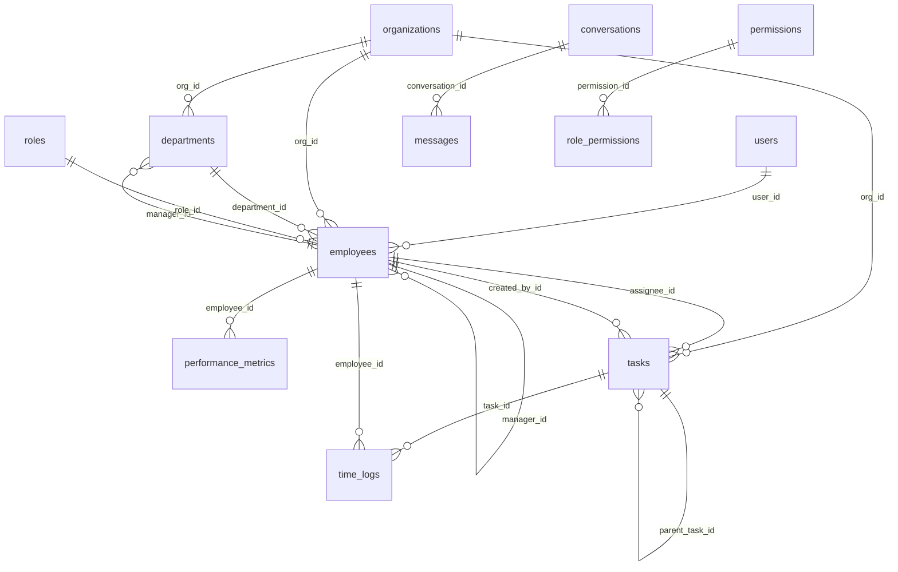

# OMS Database Schema Analysis

**Database**: `oms`  
**Generated**: 1/15/2026, 3:56:28 PM  
**Total Tables**: 13

---

## 📑 Table of Contents

1. [conversations](#conversations)
2. [departments](#departments)
3. [employees](#employees)
4. [messages](#messages)
5. [organizations](#organizations)
6. [performance_metrics](#performance-metrics)
7. [permissions](#permissions)
8. [role_permissions](#role-permissions)
9. [roles](#roles)
10. [sessions](#sessions)
11. [tasks](#tasks)
12. [time_logs](#time-logs)
13. [users](#users)

---

## conversations

### Purpose
Chat conversation threads.

### Columns

| Column | Type | Nullable | Key | Default | Extra | Description |
|--------|------|----------|-----|---------|-------|-------------|
| `id` | int | NO | PRI | - | auto_increment | Primary key |
| `title` | varchar(255) | YES | - | - | - | Data field |
| `created_at` | timestamp | YES | - | CURRENT_TIMESTAMP | DEFAULT_GENERATED | Timestamp of record creation |

### Indexes

| Index Name | Columns | Type |
|------------|---------|------|
| `PRIMARY` | id | UNIQUE |

---

## departments

### Purpose
Organizational structure - departments within organizations.

### Columns

| Column | Type | Nullable | Key | Default | Extra | Description |
|--------|------|----------|-----|---------|-------|-------------|
| `id` | int | NO | PRI | - | auto_increment | Primary key |
| `name` | varchar(255) | NO | - | - | - | Name field |
| `org_id` | int | YES | MUL | - | - | Foreign key to org table |
| `manager_id` | int | YES | MUL | - | - | Foreign key to manager table |
| `created_at` | timestamp | YES | - | CURRENT_TIMESTAMP | DEFAULT_GENERATED | Timestamp of record creation |

### Relationships

| Column | References | Description |
|--------|------------|-------------|
| `org_id` | `organizations.id` | Belongs to organization (multi-tenancy) |
| `manager_id` | `employees.id` | Reports to manager (hierarchy) |

### Indexes

| Index Name | Columns | Type |
|------------|---------|------|
| `fk_departments_manager` | manager_id | INDEX |
| `org_id` | org_id | INDEX |
| `PRIMARY` | id | UNIQUE |

---

## employees

### Purpose
Links users to organizations with employment details and hierarchy.

### Columns

| Column | Type | Nullable | Key | Default | Extra | Description |
|--------|------|----------|-----|---------|-------|-------------|
| `id` | int | NO | PRI | - | auto_increment | Primary key |
| `user_id` | varchar(255) | YES | MUL | - | - | Foreign key to user table |
| `org_id` | int | YES | MUL | - | - | Foreign key to org table |
| `department_id` | int | YES | MUL | - | - | Foreign key to department table |
| `manager_id` | int | YES | MUL | - | - | Foreign key to manager table |
| `designation` | varchar(255) | YES | - | - | - | Data field |
| `role` | varchar(50) | YES | - | - | - | Role/permission level |
| `joining_date` | date | YES | - | - | - | Date field |
| `employment_type` | varchar(50) | YES | - | - | - | Type classification |
| `work_type` | varchar(50) | YES | - | - | - | Type classification |
| `salary` | decimal(10,2) | YES | - | - | - | Salary amount |
| `is_active` | tinyint(1) | YES | - | 1 | - | Boolean flag |
| `created_at` | timestamp | YES | - | CURRENT_TIMESTAMP | DEFAULT_GENERATED | Timestamp of record creation |
| `role_id` | int | NO | MUL | - | - | Foreign key to role table |

### Relationships

| Column | References | Description |
|--------|------------|-------------|
| `user_id` | `users.id` | Links to user account |
| `org_id` | `organizations.id` | Belongs to organization (multi-tenancy) |
| `department_id` | `departments.id` | Belongs to department |
| `manager_id` | `employees.id` | Reports to manager (hierarchy) |
| `role_id` | `roles.id` | References roles |

### Indexes

| Index Name | Columns | Type |
|------------|---------|------|
| `department_id` | department_id | INDEX |
| `fk_employees_roles` | role_id | INDEX |
| `manager_id` | manager_id | INDEX |
| `org_id` | org_id | INDEX |
| `PRIMARY` | id | UNIQUE |
| `user_id` | user_id | INDEX |

---

## messages

### Purpose
Individual messages within conversations.

### Columns

| Column | Type | Nullable | Key | Default | Extra | Description |
|--------|------|----------|-----|---------|-------|-------------|
| `id` | int | NO | PRI | - | auto_increment | Primary key |
| `conversation_id` | int | YES | MUL | - | - | Foreign key to conversation table |
| `role` | varchar(50) | YES | - | - | - | Role/permission level |
| `content` | text | YES | - | - | - | Data field |
| `created_at` | timestamp | YES | - | CURRENT_TIMESTAMP | DEFAULT_GENERATED | Timestamp of record creation |

### Relationships

| Column | References | Description |
|--------|------------|-------------|
| `conversation_id` | `conversations.id` | Belongs to conversation |

### Indexes

| Index Name | Columns | Type |
|------------|---------|------|
| `conversation_id` | conversation_id | INDEX |
| `PRIMARY` | id | UNIQUE |

---

## organizations

### Purpose
Multi-tenant root table storing organization/company information.

### Columns

| Column | Type | Nullable | Key | Default | Extra | Description |
|--------|------|----------|-----|---------|-------|-------------|
| `id` | int | NO | PRI | - | auto_increment | Primary key |
| `name` | varchar(255) | NO | - | - | - | Name field |
| `slug` | varchar(255) | NO | UNI | - | - | URL-friendly identifier |
| `plan` | varchar(50) | YES | - | - | - | Data field |
| `created_at` | timestamp | YES | - | CURRENT_TIMESTAMP | DEFAULT_GENERATED | Timestamp of record creation |

### Indexes

| Index Name | Columns | Type |
|------------|---------|------|
| `PRIMARY` | id | UNIQUE |
| `slug` | slug | UNIQUE |

---

## performance_metrics

### Purpose
Weekly performance analytics for employees.

### Columns

| Column | Type | Nullable | Key | Default | Extra | Description |
|--------|------|----------|-----|---------|-------|-------------|
| `id` | int | NO | PRI | - | auto_increment | Primary key |
| `employee_id` | int | YES | MUL | - | - | Foreign key to employee table |
| `week_start_date` | date | YES | - | - | - | Date field |
| `task_completion_rate` | decimal(5,2) | YES | - | - | - | Percentage rate |
| `on_time_rate` | decimal(5,2) | YES | - | - | - | Time/timestamp field |
| `attendance_score` | decimal(5,2) | YES | - | - | - | Calculated score |
| `total_score` | decimal(5,2) | YES | - | - | - | Calculated score |
| `created_at` | timestamp | YES | - | CURRENT_TIMESTAMP | DEFAULT_GENERATED | Timestamp of record creation |

### Relationships

| Column | References | Description |
|--------|------------|-------------|
| `employee_id` | `employees.id` | Associated with employee |

### Indexes

| Index Name | Columns | Type |
|------------|---------|------|
| `employee_id` | employee_id | INDEX |
| `PRIMARY` | id | UNIQUE |

---

## permissions

### Purpose
RBAC permission definitions.

### Columns

| Column | Type | Nullable | Key | Default | Extra | Description |
|--------|------|----------|-----|---------|-------|-------------|
| `id` | int | NO | PRI | - | auto_increment | Primary key |
| `name` | varchar(100) | NO | UNI | - | - | Name field |
| `resource` | varchar(50) | NO | - | - | - | Data field |
| `action` | varchar(20) | NO | - | - | - | Data field |
| `description` | text | YES | - | - | - | Data field |
| `created_at` | timestamp | YES | - | CURRENT_TIMESTAMP | DEFAULT_GENERATED | Timestamp of record creation |

### Indexes

| Index Name | Columns | Type |
|------------|---------|------|
| `name` | name | UNIQUE |
| `PRIMARY` | id | UNIQUE |

---

## role_permissions

### Purpose
Junction table mapping roles to permissions.

### Columns

| Column | Type | Nullable | Key | Default | Extra | Description |
|--------|------|----------|-----|---------|-------|-------------|
| `id` | int | NO | PRI | - | auto_increment | Primary key |
| `role` | varchar(50) | NO | - | - | - | Role/permission level |
| `permission_id` | int | NO | MUL | - | - | Foreign key to permission table |
| `created_at` | timestamp | YES | - | CURRENT_TIMESTAMP | DEFAULT_GENERATED | Timestamp of record creation |
| `role_id` | int | YES | - | - | - | Foreign key to role table |

### Relationships

| Column | References | Description |
|--------|------------|-------------|
| `permission_id` | `permissions.id` | Links to permission |

### Indexes

| Index Name | Columns | Type |
|------------|---------|------|
| `fk_role_permissions_permission` | permission_id | INDEX |
| `PRIMARY` | id | UNIQUE |

---

## roles

### Purpose
Stores roles data.

### Columns

| Column | Type | Nullable | Key | Default | Extra | Description |
|--------|------|----------|-----|---------|-------|-------------|
| `id` | int | NO | PRI | - | auto_increment | Primary key |
| `name` | varchar(50) | NO | UNI | - | - | Name field |
| `slug` | varchar(50) | NO | UNI | - | - | URL-friendly identifier |
| `description` | text | YES | - | - | - | Data field |
| `created_at` | timestamp | YES | - | CURRENT_TIMESTAMP | DEFAULT_GENERATED | Timestamp of record creation |

### Indexes

| Index Name | Columns | Type |
|------------|---------|------|
| `name` | name | UNIQUE |
| `PRIMARY` | id | UNIQUE |
| `slug` | slug | UNIQUE |

---

## sessions

### Purpose
Manages user session data for authentication persistence.

### Columns

| Column | Type | Nullable | Key | Default | Extra | Description |
|--------|------|----------|-----|---------|-------|-------------|
| `sid` | varchar(255) | NO | PRI | - | - | Data field |
| `sess` | json | NO | - | - | - | Data field |
| `expire` | timestamp | NO | - | - | - | Data field |

### Indexes

| Index Name | Columns | Type |
|------------|---------|------|
| `PRIMARY` | sid | UNIQUE |

---

## tasks

### Purpose
Task management system with ClickUp-style features.

### Columns

| Column | Type | Nullable | Key | Default | Extra | Description |
|--------|------|----------|-----|---------|-------|-------------|
| `id` | int | NO | PRI | - | auto_increment | Primary key |
| `title` | varchar(255) | NO | - | - | - | Data field |
| `description` | text | YES | - | - | - | Data field |
| `status` | varchar(50) | YES | - | - | - | Status indicator |
| `priority` | varchar(50) | YES | - | - | - | Data field |
| `org_id` | int | YES | MUL | - | - | Foreign key to org table |
| `assignee_id` | int | YES | MUL | - | - | Foreign key to assignee table |
| `created_by_id` | int | YES | MUL | - | - | Foreign key to created_by table |
| `parent_task_id` | int | YES | MUL | - | - | Foreign key to parent_task table |
| `due_date` | timestamp | YES | - | - | - | Date field |
| `estimated_hours` | decimal(10,2) | YES | - | - | - | Data field |
| `actual_hours` | decimal(10,2) | YES | - | 0.00 | - | Data field |
| `created_at` | timestamp | YES | - | CURRENT_TIMESTAMP | DEFAULT_GENERATED | Timestamp of record creation |
| `updated_at` | timestamp | YES | - | CURRENT_TIMESTAMP | DEFAULT_GENERATED on update CURRENT_TIMESTAMP | Timestamp of last update |

### Relationships

| Column | References | Description |
|--------|------------|-------------|
| `org_id` | `organizations.id` | Belongs to organization (multi-tenancy) |
| `assignee_id` | `employees.id` | Assigned to employee |
| `created_by_id` | `employees.id` | Created by employee |
| `parent_task_id` | `tasks.id` | Subtask relationship |

### Indexes

| Index Name | Columns | Type |
|------------|---------|------|
| `assignee_id` | assignee_id | INDEX |
| `created_by_id` | created_by_id | INDEX |
| `org_id` | org_id | INDEX |
| `parent_task_id` | parent_task_id | INDEX |
| `PRIMARY` | id | UNIQUE |

---

## time_logs

### Purpose
Time tracking entries for tasks and employees.

### Columns

| Column | Type | Nullable | Key | Default | Extra | Description |
|--------|------|----------|-----|---------|-------|-------------|
| `id` | int | NO | PRI | - | auto_increment | Primary key |
| `task_id` | int | YES | MUL | - | - | Foreign key to task table |
| `employee_id` | int | YES | MUL | - | - | Foreign key to employee table |
| `start_time` | timestamp | NO | - | - | - | Time/timestamp field |
| `end_time` | timestamp | YES | - | - | - | Time/timestamp field |
| `duration_minutes` | int | YES | - | - | - | Data field |
| `created_at` | timestamp | YES | - | CURRENT_TIMESTAMP | DEFAULT_GENERATED | Timestamp of record creation |

### Relationships

| Column | References | Description |
|--------|------------|-------------|
| `task_id` | `tasks.id` | Associated with task |
| `employee_id` | `employees.id` | Associated with employee |

### Indexes

| Index Name | Columns | Type |
|------------|---------|------|
| `employee_id` | employee_id | INDEX |
| `PRIMARY` | id | UNIQUE |
| `task_id` | task_id | INDEX |

---

## users

### Purpose
Stores user authentication and profile information for the system.

### Columns

| Column | Type | Nullable | Key | Default | Extra | Description |
|--------|------|----------|-----|---------|-------|-------------|
| `id` | varchar(255) | NO | PRI | - | - | Primary key |
| `first_name` | varchar(255) | YES | - | - | - | Name field |
| `last_name` | varchar(255) | YES | - | - | - | Name field |
| `username` | varchar(150) | YES | UNI | - | - | Unique username |
| `role` | varchar(50) | NO | - | user | - | Role/permission level |
| `email` | varchar(255) | YES | UNI | - | - | Email address |
| `password` | varchar(255) | YES | - | - | - | Hashed password |
| `profile_image_url` | varchar(255) | YES | - | - | - | Data field |
| `created_at` | timestamp | YES | - | - | - | Timestamp of record creation |
| `updated_at` | timestamp | YES | - | - | - | Timestamp of last update |

### Indexes

| Index Name | Columns | Type |
|------------|---------|------|
| `email` | email | UNIQUE |
| `PRIMARY` | id | UNIQUE |
| `users_username_unique` | username | UNIQUE |

---

## 🔗 Database Relationships

## 📊 Summary Statistics

- **Total Tables**: 13
- **Total Columns**: 90
- **Total Foreign Keys**: 16
- **Total Indexes**: 35

### Tables by Column Count

- **employees**: 14 columns
- **tasks**: 14 columns
- **users**: 10 columns
- **performance_metrics**: 8 columns
- **time_logs**: 7 columns
- **permissions**: 6 columns
- **departments**: 5 columns
- **messages**: 5 columns
- **organizations**: 5 columns
- **role_permissions**: 5 columns
- **roles**: 5 columns
- **conversations**: 3 columns
- **sessions**: 3 columns
