# OMS Database Schema Analysis

**Database**: `oms`  
**Generated**: 2/2/2026, 1:02:21 PM  
**Total Tables**: 28

---

## 📑 Table of Contents

1. [audit_logs](#audit-logs)
2. [calls](#calls)
3. [chat_room_participants](#chat-room-participants)
4. [chat_rooms](#chat-rooms)
5. [conversations](#conversations)
6. [departments](#departments)
7. [employees](#employees)
8. [invoices](#invoices)
9. [leave_requests](#leave-requests)
10. [meeting_participants](#meeting-participants)
11. [meetings](#meetings)
12. [message_reactions](#message-reactions)
13. [message_status](#message-status)
14. [messages](#messages)
15. [notifications](#notifications)
16. [organizations](#organizations)
17. [performance_metrics](#performance-metrics)
18. [permissions](#permissions)
19. [role_permissions](#role-permissions)
20. [roles](#roles)
21. [sessions](#sessions)
22. [sticker_packs](#sticker-packs)
23. [stickers](#stickers)
24. [tasks](#tasks)
25. [time_logs](#time-logs)
26. [user_contacts](#user-contacts)
27. [user_sticker_packs](#user-sticker-packs)
28. [users](#users)

---

## audit_logs

### Purpose
Stores audit logs data.

### Columns

| Column | Type | Nullable | Key | Default | Extra | Description |
|--------|------|----------|-----|---------|-------|-------------|
| `id` | int | NO | PRI | - | auto_increment | Primary key |
| `table_name` | varchar(100) | NO | MUL | - | - | Name field |
| `record_id` | int | NO | - | - | - | Foreign key to record table |
| `action` | varchar(20) | NO | - | - | - | Data field |
| `user_id` | varchar(255) | YES | MUL | - | - | Foreign key to user table |
| `old_value` | json | YES | - | - | - | Data field |
| `new_value` | json | YES | - | - | - | Data field |
| `ip_address` | varchar(45) | YES | - | - | - | Data field |
| `user_agent` | text | YES | - | - | - | Data field |
| `created_at` | timestamp | YES | - | CURRENT_TIMESTAMP | DEFAULT_GENERATED | Timestamp of record creation |

### Relationships

| Column | References | Description |
|--------|------------|-------------|
| `user_id` | `users.id` | Links to user account |

### Indexes

| Index Name | Columns | Type |
|------------|---------|------|
| `idx_audit_table` | table_name, record_id | INDEX |
| `idx_audit_user` | user_id | INDEX |
| `PRIMARY` | id | UNIQUE |

---

## calls

### Purpose
Stores calls data.

### Columns

| Column | Type | Nullable | Key | Default | Extra | Description |
|--------|------|----------|-----|---------|-------|-------------|
| `id` | int | NO | PRI | - | auto_increment | Primary key |
| `chat_room_id` | int | YES | MUL | - | - | Foreign key to chat_room table |
| `caller_id` | varchar(255) | NO | MUL | - | - | Foreign key to caller table |
| `callee_id` | varchar(255) | YES | MUL | - | - | Foreign key to callee table |
| `call_type` | enum('voice','video') | NO | - | - | - | Type classification |
| `status` | enum('initiated','ringing','connected','ended','missed','rejected') | YES | - | initiated | - | Status indicator |
| `duration` | int | YES | - | 0 | - | Data field |
| `started_at` | timestamp | YES | - | - | - | Data field |
| `ended_at` | timestamp | YES | - | - | - | Data field |
| `created_at` | timestamp | YES | - | CURRENT_TIMESTAMP | DEFAULT_GENERATED | Timestamp of record creation |

### Relationships

| Column | References | Description |
|--------|------------|-------------|
| `chat_room_id` | `chat_rooms.id` | References chat_rooms |
| `caller_id` | `users.id` | References users |
| `callee_id` | `users.id` | References users |
| `caller_id` | `users.id` | References users |
| `callee_id` | `users.id` | References users |

### Indexes

| Index Name | Columns | Type |
|------------|---------|------|
| `callee_id` | callee_id | INDEX |
| `caller_id` | caller_id | INDEX |
| `chat_room_id` | chat_room_id | INDEX |
| `PRIMARY` | id | UNIQUE |

---

## chat_room_participants

### Purpose
Stores chat room participants data.

### Columns

| Column | Type | Nullable | Key | Default | Extra | Description |
|--------|------|----------|-----|---------|-------|-------------|
| `id` | int | NO | PRI | - | auto_increment | Primary key |
| `chat_room_id` | int | NO | MUL | - | - | Foreign key to chat_room table |
| `user_id` | varchar(255) | NO | MUL | - | - | Foreign key to user table |
| `role` | enum('admin','member') | YES | - | member | - | Role/permission level |
| `joined_at` | timestamp | YES | - | CURRENT_TIMESTAMP | DEFAULT_GENERATED | Data field |
| `last_read_message_id` | int | YES | MUL | - | - | Foreign key to last_read_message table |

### Relationships

| Column | References | Description |
|--------|------------|-------------|
| `chat_room_id` | `chat_rooms.id` | References chat_rooms |
| `last_read_message_id` | `messages.id` | References messages |
| `user_id` | `users.id` | Links to user account |
| `last_read_message_id` | `messages.id` | References messages |
| `last_read_message_id` | `messages.id` | References messages |
| `user_id` | `users.id` | Links to user account |
| `last_read_message_id` | `messages.id` | References messages |
| `user_id` | `users.id` | Links to user account |
| `last_read_message_id` | `messages.id` | References messages |
| `user_id` | `users.id` | Links to user account |
| `last_read_message_id` | `messages.id` | References messages |

### Indexes

| Index Name | Columns | Type |
|------------|---------|------|
| `last_read_message_id` | last_read_message_id | INDEX |
| `PRIMARY` | id | UNIQUE |
| `unique_participant` | chat_room_id, user_id | UNIQUE |
| `user_id` | user_id | INDEX |

---

## chat_rooms

### Purpose
Stores chat rooms data.

### Columns

| Column | Type | Nullable | Key | Default | Extra | Description |
|--------|------|----------|-----|---------|-------|-------------|
| `id` | int | NO | PRI | - | auto_increment | Primary key |
| `name` | varchar(255) | YES | - | - | - | Name field |
| `type` | enum('private','group','broadcast') | YES | - | private | - | Type classification |
| `avatar_url` | varchar(255) | YES | - | - | - | Data field |
| `description` | text | YES | - | - | - | Data field |
| `created_by` | varchar(255) | YES | MUL | - | - | Data field |
| `is_archived` | tinyint(1) | YES | - | 0 | - | Boolean flag |
| `created_at` | timestamp | YES | - | CURRENT_TIMESTAMP | DEFAULT_GENERATED | Timestamp of record creation |
| `updated_at` | timestamp | YES | - | CURRENT_TIMESTAMP | DEFAULT_GENERATED on update CURRENT_TIMESTAMP | Timestamp of last update |

### Relationships

| Column | References | Description |
|--------|------------|-------------|
| `created_by` | `users.id` | References users |
| `created_by` | `users.id` | References users |
| `created_by` | `users.id` | References users |

### Indexes

| Index Name | Columns | Type |
|------------|---------|------|
| `created_by` | created_by | INDEX |
| `PRIMARY` | id | UNIQUE |

---

## conversations

### Purpose
Chat conversation threads.

### Columns

| Column | Type | Nullable | Key | Default | Extra | Description |
|--------|------|----------|-----|---------|-------|-------------|
| `id` | int | NO | PRI | - | auto_increment | Primary key |
| `title` | varchar(255) | YES | - | - | - | Data field |
| `created_at` | timestamp | YES | - | CURRENT_TIMESTAMP | DEFAULT_GENERATED | Timestamp of record creation |

### Indexes

| Index Name | Columns | Type |
|------------|---------|------|
| `PRIMARY` | id | UNIQUE |

---

## departments

### Purpose
Organizational structure - departments within organizations.

### Columns

| Column | Type | Nullable | Key | Default | Extra | Description |
|--------|------|----------|-----|---------|-------|-------------|
| `id` | int | NO | PRI | - | auto_increment | Primary key |
| `name` | varchar(255) | NO | - | - | - | Name field |
| `org_id` | int | YES | MUL | - | - | Foreign key to org table |
| `manager_id` | int | YES | MUL | - | - | Foreign key to manager table |
| `created_at` | timestamp | YES | - | CURRENT_TIMESTAMP | DEFAULT_GENERATED | Timestamp of record creation |

### Relationships

| Column | References | Description |
|--------|------------|-------------|
| `org_id` | `organizations.id` | Belongs to organization (multi-tenancy) |
| `manager_id` | `employees.id` | Reports to manager (hierarchy) |

### Indexes

| Index Name | Columns | Type |
|------------|---------|------|
| `fk_departments_manager` | manager_id | INDEX |
| `org_id` | org_id | INDEX |
| `PRIMARY` | id | UNIQUE |

---

## employees

### Purpose
Links users to organizations with employment details and hierarchy.

### Columns

| Column | Type | Nullable | Key | Default | Extra | Description |
|--------|------|----------|-----|---------|-------|-------------|
| `id` | int | NO | PRI | - | auto_increment | Primary key |
| `user_id` | varchar(255) | YES | MUL | - | - | Foreign key to user table |
| `org_id` | int | YES | MUL | - | - | Foreign key to org table |
| `department_id` | int | YES | MUL | - | - | Foreign key to department table |
| `manager_id` | int | YES | MUL | - | - | Foreign key to manager table |
| `designation` | varchar(255) | YES | - | - | - | Data field |
| `role` | varchar(50) | YES | - | - | - | Role/permission level |
| `joining_date` | date | YES | - | - | - | Date field |
| `employment_type` | varchar(50) | YES | - | - | - | Type classification |
| `work_type` | varchar(50) | YES | - | - | - | Type classification |
| `salary` | decimal(10,2) | YES | - | - | - | Salary amount |
| `is_active` | tinyint(1) | YES | - | 1 | - | Boolean flag |
| `created_at` | timestamp | YES | - | CURRENT_TIMESTAMP | DEFAULT_GENERATED | Timestamp of record creation |
| `role_id` | int | NO | MUL | - | - | Foreign key to role table |

### Relationships

| Column | References | Description |
|--------|------------|-------------|
| `user_id` | `users.id` | Links to user account |
| `org_id` | `organizations.id` | Belongs to organization (multi-tenancy) |
| `department_id` | `departments.id` | Belongs to department |
| `manager_id` | `employees.id` | Reports to manager (hierarchy) |
| `role_id` | `roles.id` | References roles |

### Indexes

| Index Name | Columns | Type |
|------------|---------|------|
| `department_id` | department_id | INDEX |
| `fk_employees_roles` | role_id | INDEX |
| `idx_employee_org_dept` | org_id, department_id | INDEX |
| `manager_id` | manager_id | INDEX |
| `PRIMARY` | id | UNIQUE |
| `user_id` | user_id | INDEX |

---

## invoices

### Purpose
Stores invoices data.

### Columns

| Column | Type | Nullable | Key | Default | Extra | Description |
|--------|------|----------|-----|---------|-------|-------------|
| `id` | int | NO | PRI | - | auto_increment | Primary key |
| `org_id` | int | NO | MUL | - | - | Foreign key to org table |
| `invoice_number` | varchar(50) | NO | UNI | - | - | Data field |
| `client_name` | varchar(255) | NO | - | - | - | Name field |
| `client_email` | varchar(255) | YES | - | - | - | Email address |
| `client_address` | text | YES | - | - | - | Data field |
| `amount` | decimal(10,2) | NO | - | - | - | Data field |
| `tax_amount` | decimal(10,2) | YES | - | 0.00 | - | Data field |
| `total_amount` | decimal(10,2) | NO | - | - | - | Data field |
| `issue_date` | date | NO | - | - | - | Date field |
| `due_date` | date | NO | MUL | - | - | Date field |
| `status` | varchar(50) | NO | MUL | draft | - | Status indicator |
| `payment_method` | varchar(50) | YES | - | - | - | Data field |
| `payment_date` | date | YES | - | - | - | Date field |
| `notes` | text | YES | - | - | - | Data field |
| `created_by` | int | YES | MUL | - | - | Data field |
| `created_at` | timestamp | NO | - | CURRENT_TIMESTAMP | DEFAULT_GENERATED | Timestamp of record creation |
| `updated_at` | timestamp | NO | - | CURRENT_TIMESTAMP | DEFAULT_GENERATED on update CURRENT_TIMESTAMP | Timestamp of last update |

### Relationships

| Column | References | Description |
|--------|------------|-------------|
| `created_by` | `employees.id` | References employees |
| `org_id` | `organizations.id` | Belongs to organization (multi-tenancy) |

### Indexes

| Index Name | Columns | Type |
|------------|---------|------|
| `fk_invoice_creator` | created_by | INDEX |
| `fk_invoice_org` | org_id | INDEX |
| `idx_invoice_due_date` | due_date | INDEX |
| `idx_invoice_status` | status | INDEX |
| `invoice_number` | invoice_number | UNIQUE |
| `PRIMARY` | id | UNIQUE |
| `unique_invoice_number` | invoice_number | UNIQUE |

---

## leave_requests

### Purpose
Stores leave requests data.

### Columns

| Column | Type | Nullable | Key | Default | Extra | Description |
|--------|------|----------|-----|---------|-------|-------------|
| `id` | int | NO | PRI | - | auto_increment | Primary key |
| `employee_id` | int | NO | MUL | - | - | Foreign key to employee table |
| `leave_type` | varchar(50) | NO | - | - | - | Type classification |
| `start_date` | date | NO | MUL | - | - | Date field |
| `end_date` | date | NO | - | - | - | Date field |
| `total_days` | int | NO | - | - | - | Data field |
| `reason` | text | YES | - | - | - | Data field |
| `status` | varchar(50) | NO | MUL | pending | - | Status indicator |
| `approved_by` | int | YES | MUL | - | - | Data field |
| `rejected_by` | int | YES | MUL | - | - | Data field |
| `approval_date` | timestamp | YES | - | - | - | Date field |
| `rejection_reason` | text | YES | - | - | - | Data field |
| `created_at` | timestamp | NO | - | CURRENT_TIMESTAMP | DEFAULT_GENERATED | Timestamp of record creation |
| `updated_at` | timestamp | NO | - | CURRENT_TIMESTAMP | DEFAULT_GENERATED on update CURRENT_TIMESTAMP | Timestamp of last update |
| `manager_approval_status` | varchar(20) | YES | - | pending | - | Status indicator |
| `hr_approval_status` | varchar(20) | YES | - | pending | - | Status indicator |
| `manager_approved_by` | int | YES | MUL | - | - | Data field |
| `manager_rejected_by` | int | YES | MUL | - | - | Data field |
| `hr_approved_by` | int | YES | MUL | - | - | Data field |
| `hr_rejected_by` | int | YES | MUL | - | - | Data field |
| `rejection_date` | timestamp | YES | - | - | - | Date field |
| `manager_approval_date` | timestamp | YES | - | - | - | Date field |
| `manager_rejection_date` | timestamp | YES | - | - | - | Date field |
| `hr_approval_date` | timestamp | YES | - | - | - | Date field |
| `hr_rejection_date` | timestamp | YES | - | - | - | Date field |
| `manager_approval_notes` | text | YES | - | - | - | Data field |
| `manager_rejection_notes` | text | YES | - | - | - | Data field |
| `hr_approval_notes` | text | YES | - | - | - | Data field |
| `hr_rejection_notes` | text | YES | - | - | - | Data field |

### Relationships

| Column | References | Description |
|--------|------------|-------------|
| `approved_by` | `employees.id` | References employees |
| `employee_id` | `employees.id` | Associated with employee |
| `hr_approved_by` | `employees.id` | References employees |
| `hr_rejected_by` | `employees.id` | References employees |
| `manager_approved_by` | `employees.id` | References employees |
| `manager_rejected_by` | `employees.id` | References employees |
| `rejected_by` | `employees.id` | References employees |
| `hr_approved_by` | `employees.id` | References employees |
| `hr_rejected_by` | `employees.id` | References employees |
| `manager_approved_by` | `employees.id` | References employees |
| `manager_rejected_by` | `employees.id` | References employees |

### Indexes

| Index Name | Columns | Type |
|------------|---------|------|
| `fk_leave_approver` | approved_by | INDEX |
| `fk_leave_employee` | employee_id | INDEX |
| `fk_leave_hr_approved` | hr_approved_by | INDEX |
| `fk_leave_hr_rejected` | hr_rejected_by | INDEX |
| `fk_leave_mgr_approved` | manager_approved_by | INDEX |
| `fk_leave_mgr_rejected` | manager_rejected_by | INDEX |
| `fk_leave_rejector` | rejected_by | INDEX |
| `idx_leave_dates` | start_date, end_date | INDEX |
| `idx_leave_emp` | employee_id | INDEX |
| `idx_leave_status` | status | INDEX |
| `PRIMARY` | id | UNIQUE |

---

## meeting_participants

### Purpose
Stores meeting participants data.

### Columns

| Column | Type | Nullable | Key | Default | Extra | Description |
|--------|------|----------|-----|---------|-------|-------------|
| `id` | int | NO | PRI | - | auto_increment | Primary key |
| `meeting_id` | int | NO | MUL | - | - | Foreign key to meeting table |
| `user_id` | varchar(255) | NO | MUL | - | - | Foreign key to user table |
| `status` | enum('invited','accepted','declined','attended') | YES | - | invited | - | Status indicator |
| `joined_at` | timestamp | YES | - | - | - | Data field |
| `left_at` | timestamp | YES | - | - | - | Data field |

### Relationships

| Column | References | Description |
|--------|------------|-------------|
| `meeting_id` | `meetings.id` | References meetings |
| `user_id` | `users.id` | Links to user account |
| `user_id` | `users.id` | Links to user account |

### Indexes

| Index Name | Columns | Type |
|------------|---------|------|
| `meeting_id` | meeting_id | INDEX |
| `PRIMARY` | id | UNIQUE |
| `user_id` | user_id | INDEX |

---

## meetings

### Purpose
Stores meetings data.

### Columns

| Column | Type | Nullable | Key | Default | Extra | Description |
|--------|------|----------|-----|---------|-------|-------------|
| `id` | int | NO | PRI | - | auto_increment | Primary key |
| `title` | varchar(255) | NO | - | - | - | Data field |
| `description` | text | YES | - | - | - | Data field |
| `chat_room_id` | int | YES | MUL | - | - | Foreign key to chat_room table |
| `organizer_id` | varchar(255) | NO | MUL | - | - | Foreign key to organizer table |
| `scheduled_for` | timestamp | NO | - | - | - | Data field |
| `duration` | int | NO | - | - | - | Data field |
| `meeting_link` | varchar(255) | YES | - | - | - | Data field |
| `status` | enum('scheduled','ongoing','completed','cancelled') | YES | - | scheduled | - | Status indicator |
| `created_at` | timestamp | YES | - | CURRENT_TIMESTAMP | DEFAULT_GENERATED | Timestamp of record creation |
| `updated_at` | timestamp | YES | - | CURRENT_TIMESTAMP | DEFAULT_GENERATED on update CURRENT_TIMESTAMP | Timestamp of last update |

### Relationships

| Column | References | Description |
|--------|------------|-------------|
| `chat_room_id` | `chat_rooms.id` | References chat_rooms |
| `organizer_id` | `users.id` | References users |
| `organizer_id` | `users.id` | References users |

### Indexes

| Index Name | Columns | Type |
|------------|---------|------|
| `chat_room_id` | chat_room_id | INDEX |
| `organizer_id` | organizer_id | INDEX |
| `PRIMARY` | id | UNIQUE |

---

## message_reactions

### Purpose
Stores message reactions data.

### Columns

| Column | Type | Nullable | Key | Default | Extra | Description |
|--------|------|----------|-----|---------|-------|-------------|
| `id` | int | NO | PRI | - | auto_increment | Primary key |
| `message_id` | int | NO | MUL | - | - | Foreign key to message table |
| `user_id` | varchar(255) | NO | MUL | - | - | Foreign key to user table |
| `emoji` | varchar(10) | NO | - | - | - | Data field |
| `created_at` | timestamp | YES | - | CURRENT_TIMESTAMP | DEFAULT_GENERATED | Timestamp of record creation |

### Relationships

| Column | References | Description |
|--------|------------|-------------|
| `message_id` | `messages.id` | References messages |
| `user_id` | `users.id` | Links to user account |
| `user_id` | `users.id` | Links to user account |

### Indexes

| Index Name | Columns | Type |
|------------|---------|------|
| `PRIMARY` | id | UNIQUE |
| `unique_user_reaction` | message_id, user_id, emoji | UNIQUE |
| `user_id` | user_id | INDEX |

---

## message_status

### Purpose
Stores message status data.

### Columns

| Column | Type | Nullable | Key | Default | Extra | Description |
|--------|------|----------|-----|---------|-------|-------------|
| `id` | int | NO | PRI | - | auto_increment | Primary key |
| `message_id` | int | NO | MUL | - | - | Foreign key to message table |
| `user_id` | varchar(255) | NO | MUL | - | - | Foreign key to user table |
| `status` | enum('sent','delivered','read') | YES | - | sent | - | Status indicator |
| `delivered_at` | timestamp | YES | - | - | - | Data field |
| `read_at` | timestamp | YES | - | - | - | Data field |

### Relationships

| Column | References | Description |
|--------|------------|-------------|
| `message_id` | `messages.id` | References messages |
| `user_id` | `users.id` | Links to user account |
| `user_id` | `users.id` | Links to user account |

### Indexes

| Index Name | Columns | Type |
|------------|---------|------|
| `PRIMARY` | id | UNIQUE |
| `unique_user_message_status` | message_id, user_id | UNIQUE |
| `user_id` | user_id | INDEX |

---

## messages

### Purpose
Individual messages within conversations.

### Columns

| Column | Type | Nullable | Key | Default | Extra | Description |
|--------|------|----------|-----|---------|-------|-------------|
| `id` | int | NO | PRI | - | auto_increment | Primary key |
| `conversation_id` | int | YES | MUL | - | - | Foreign key to conversation table |
| `role` | varchar(50) | YES | - | - | - | Role/permission level |
| `content` | text | YES | - | - | - | Data field |
| `created_at` | timestamp | YES | - | CURRENT_TIMESTAMP | DEFAULT_GENERATED | Timestamp of record creation |
| `chat_room_id` | int | YES | MUL | - | - | Foreign key to chat_room table |
| `message_type` | enum('text','image','video','audio','document','sticker','location','contact') | YES | - | text | - | Type classification |
| `media_url` | varchar(255) | YES | - | - | - | Data field |
| `media_type` | varchar(50) | YES | - | - | - | Type classification |
| `file_size` | int | YES | - | - | - | Data field |
| `duration` | int | YES | - | - | - | Data field |
| `reply_to_message_id` | int | YES | MUL | - | - | Foreign key to reply_to_message table |
| `is_edited` | tinyint(1) | YES | - | 0 | - | Boolean flag |
| `is_deleted` | tinyint(1) | YES | - | 0 | - | Boolean flag |
| `deleted_for_everyone` | tinyint(1) | YES | - | 0 | - | Data field |
| `sender_id` | varchar(255) | NO | MUL | - | - | Foreign key to sender table |
| `updated_at` | timestamp | NO | - | CURRENT_TIMESTAMP | DEFAULT_GENERATED on update CURRENT_TIMESTAMP | Timestamp of last update |

### Relationships

| Column | References | Description |
|--------|------------|-------------|
| `reply_to_message_id` | `messages.id` | References messages |
| `reply_to_message_id` | `messages.id` | References messages |
| `reply_to_message_id` | `messages.id` | References messages |
| `reply_to_message_id` | `messages.id` | References messages |
| `reply_to_message_id` | `messages.id` | References messages |
| `sender_id` | `users.id` | References users |
| `reply_to_message_id` | `messages.id` | References messages |

### Indexes

| Index Name | Columns | Type |
|------------|---------|------|
| `conversation_id` | conversation_id | INDEX |
| `idx_messages_chat_room_created` | chat_room_id, created_at | INDEX |
| `PRIMARY` | id | UNIQUE |
| `reply_to_message_id` | reply_to_message_id | INDEX |
| `sender_id` | sender_id | INDEX |

---

## notifications

### Purpose
Stores notifications data.

### Columns

| Column | Type | Nullable | Key | Default | Extra | Description |
|--------|------|----------|-----|---------|-------|-------------|
| `id` | int | NO | PRI | - | auto_increment | Primary key |
| `user_id` | varchar(255) | NO | MUL | - | - | Foreign key to user table |
| `type` | varchar(50) | NO | - | - | - | Type classification |
| `title` | varchar(255) | NO | - | - | - | Data field |
| `description` | text | YES | - | - | - | Data field |
| `related_id` | varchar(255) | YES | - | - | - | Foreign key to related table |
| `related_type` | varchar(50) | YES | - | - | - | Type classification |
| `is_read` | tinyint(1) | YES | MUL | 0 | - | Boolean flag |
| `action_url` | varchar(255) | YES | - | - | - | Data field |
| `created_at` | timestamp | YES | MUL | CURRENT_TIMESTAMP | DEFAULT_GENERATED | Timestamp of record creation |
| `read_at` | timestamp | YES | - | - | - | Data field |

### Indexes

| Index Name | Columns | Type |
|------------|---------|------|
| `idx_created_at` | created_at | INDEX |
| `idx_is_read` | is_read | INDEX |
| `idx_user_id` | user_id | INDEX |
| `PRIMARY` | id | UNIQUE |

---

## organizations

### Purpose
Multi-tenant root table storing organization/company information.

### Columns

| Column | Type | Nullable | Key | Default | Extra | Description |
|--------|------|----------|-----|---------|-------|-------------|
| `id` | int | NO | PRI | - | auto_increment | Primary key |
| `name` | varchar(255) | NO | - | - | - | Name field |
| `slug` | varchar(255) | NO | UNI | - | - | URL-friendly identifier |
| `plan` | varchar(50) | YES | - | - | - | Data field |
| `created_at` | timestamp | YES | - | CURRENT_TIMESTAMP | DEFAULT_GENERATED | Timestamp of record creation |

### Indexes

| Index Name | Columns | Type |
|------------|---------|------|
| `PRIMARY` | id | UNIQUE |
| `slug` | slug | UNIQUE |

---

## performance_metrics

### Purpose
Weekly performance analytics for employees.

### Columns

| Column | Type | Nullable | Key | Default | Extra | Description |
|--------|------|----------|-----|---------|-------|-------------|
| `id` | int | NO | PRI | - | auto_increment | Primary key |
| `employee_id` | int | YES | MUL | - | - | Foreign key to employee table |
| `week_start_date` | date | YES | - | - | - | Date field |
| `task_completion_rate` | decimal(5,2) | YES | - | - | - | Percentage rate |
| `on_time_rate` | decimal(5,2) | YES | - | - | - | Time/timestamp field |
| `attendance_score` | decimal(5,2) | YES | - | - | - | Calculated score |
| `total_score` | decimal(5,2) | YES | - | - | - | Calculated score |
| `created_at` | timestamp | YES | - | CURRENT_TIMESTAMP | DEFAULT_GENERATED | Timestamp of record creation |

### Relationships

| Column | References | Description |
|--------|------------|-------------|
| `employee_id` | `employees.id` | Associated with employee |

### Indexes

| Index Name | Columns | Type |
|------------|---------|------|
| `employee_id` | employee_id | INDEX |
| `PRIMARY` | id | UNIQUE |

---

## permissions

### Purpose
RBAC permission definitions.

### Columns

| Column | Type | Nullable | Key | Default | Extra | Description |
|--------|------|----------|-----|---------|-------|-------------|
| `id` | int | NO | PRI | - | auto_increment | Primary key |
| `name` | varchar(100) | NO | UNI | - | - | Name field |
| `resource` | varchar(50) | NO | - | - | - | Data field |
| `action` | varchar(20) | NO | - | - | - | Data field |
| `description` | text | YES | - | - | - | Data field |
| `created_at` | timestamp | YES | - | CURRENT_TIMESTAMP | DEFAULT_GENERATED | Timestamp of record creation |

### Indexes

| Index Name | Columns | Type |
|------------|---------|------|
| `name` | name | UNIQUE |
| `PRIMARY` | id | UNIQUE |

---

## role_permissions

### Purpose
Junction table mapping roles to permissions.

### Columns

| Column | Type | Nullable | Key | Default | Extra | Description |
|--------|------|----------|-----|---------|-------|-------------|
| `id` | int | NO | PRI | - | auto_increment | Primary key |
| `role` | varchar(50) | NO | - | - | - | Role/permission level |
| `permission_id` | int | NO | MUL | - | - | Foreign key to permission table |
| `created_at` | timestamp | YES | - | CURRENT_TIMESTAMP | DEFAULT_GENERATED | Timestamp of record creation |
| `role_id` | int | YES | - | - | - | Foreign key to role table |

### Relationships

| Column | References | Description |
|--------|------------|-------------|
| `permission_id` | `permissions.id` | Links to permission |

### Indexes

| Index Name | Columns | Type |
|------------|---------|------|
| `fk_role_permissions_permission` | permission_id | INDEX |
| `PRIMARY` | id | UNIQUE |

---

## roles

### Purpose
Stores roles data.

### Columns

| Column | Type | Nullable | Key | Default | Extra | Description |
|--------|------|----------|-----|---------|-------|-------------|
| `id` | int | NO | PRI | - | auto_increment | Primary key |
| `name` | varchar(50) | NO | UNI | - | - | Name field |
| `slug` | varchar(50) | NO | UNI | - | - | URL-friendly identifier |
| `description` | text | YES | - | - | - | Data field |
| `created_at` | timestamp | YES | - | CURRENT_TIMESTAMP | DEFAULT_GENERATED | Timestamp of record creation |

### Indexes

| Index Name | Columns | Type |
|------------|---------|------|
| `name` | name | UNIQUE |
| `PRIMARY` | id | UNIQUE |
| `slug` | slug | UNIQUE |

---

## sessions

### Purpose
Manages user session data for authentication persistence.

### Columns

| Column | Type | Nullable | Key | Default | Extra | Description |
|--------|------|----------|-----|---------|-------|-------------|
| `sid` | varchar(255) | NO | PRI | - | - | Data field |
| `sess` | json | NO | - | - | - | Data field |
| `expire` | timestamp | NO | - | - | - | Data field |

### Indexes

| Index Name | Columns | Type |
|------------|---------|------|
| `PRIMARY` | sid | UNIQUE |

---

## sticker_packs

### Purpose
Stores sticker packs data.

### Columns

| Column | Type | Nullable | Key | Default | Extra | Description |
|--------|------|----------|-----|---------|-------|-------------|
| `id` | int | NO | PRI | - | auto_increment | Primary key |
| `name` | varchar(255) | NO | - | - | - | Name field |
| `creator_id` | varchar(255) | YES | MUL | - | - | Foreign key to creator table |
| `is_public` | tinyint(1) | YES | - | 1 | - | Boolean flag |
| `created_at` | timestamp | YES | - | CURRENT_TIMESTAMP | DEFAULT_GENERATED | Timestamp of record creation |

### Relationships

| Column | References | Description |
|--------|------------|-------------|
| `creator_id` | `users.id` | References users |
| `creator_id` | `users.id` | References users |

### Indexes

| Index Name | Columns | Type |
|------------|---------|------|
| `creator_id` | creator_id | INDEX |
| `PRIMARY` | id | UNIQUE |

---

## stickers

### Purpose
Stores stickers data.

### Columns

| Column | Type | Nullable | Key | Default | Extra | Description |
|--------|------|----------|-----|---------|-------|-------------|
| `id` | int | NO | PRI | - | auto_increment | Primary key |
| `pack_id` | int | NO | MUL | - | - | Foreign key to pack table |
| `name` | varchar(255) | NO | - | - | - | Name field |
| `image_url` | varchar(255) | NO | - | - | - | Data field |
| `emoji` | varchar(10) | YES | - | - | - | Data field |
| `created_at` | timestamp | YES | - | CURRENT_TIMESTAMP | DEFAULT_GENERATED | Timestamp of record creation |

### Relationships

| Column | References | Description |
|--------|------------|-------------|
| `pack_id` | `sticker_packs.id` | References sticker_packs |

### Indexes

| Index Name | Columns | Type |
|------------|---------|------|
| `pack_id` | pack_id | INDEX |
| `PRIMARY` | id | UNIQUE |

---

## tasks

### Purpose
Task management system with ClickUp-style features.

### Columns

| Column | Type | Nullable | Key | Default | Extra | Description |
|--------|------|----------|-----|---------|-------|-------------|
| `id` | int | NO | PRI | - | auto_increment | Primary key |
| `title` | varchar(255) | NO | - | - | - | Data field |
| `description` | text | YES | - | - | - | Data field |
| `status` | varchar(50) | YES | - | - | - | Status indicator |
| `priority` | varchar(50) | YES | - | - | - | Data field |
| `org_id` | int | YES | MUL | - | - | Foreign key to org table |
| `assignee_id` | int | YES | MUL | - | - | Foreign key to assignee table |
| `created_by_id` | int | YES | MUL | - | - | Foreign key to created_by table |
| `parent_task_id` | int | YES | MUL | - | - | Foreign key to parent_task table |
| `due_date` | timestamp | YES | - | - | - | Date field |
| `estimated_hours` | decimal(10,2) | YES | - | - | - | Data field |
| `actual_hours` | decimal(10,2) | YES | - | 0.00 | - | Data field |
| `created_at` | timestamp | YES | - | CURRENT_TIMESTAMP | DEFAULT_GENERATED | Timestamp of record creation |
| `updated_at` | timestamp | YES | - | CURRENT_TIMESTAMP | DEFAULT_GENERATED on update CURRENT_TIMESTAMP | Timestamp of last update |

### Relationships

| Column | References | Description |
|--------|------------|-------------|
| `org_id` | `organizations.id` | Belongs to organization (multi-tenancy) |
| `assignee_id` | `employees.id` | Assigned to employee |
| `created_by_id` | `employees.id` | Created by employee |
| `parent_task_id` | `tasks.id` | Subtask relationship |

### Indexes

| Index Name | Columns | Type |
|------------|---------|------|
| `assignee_id` | assignee_id | INDEX |
| `created_by_id` | created_by_id | INDEX |
| `idx_tasks_org_assignee` | org_id, assignee_id | INDEX |
| `parent_task_id` | parent_task_id | INDEX |
| `PRIMARY` | id | UNIQUE |

---

## time_logs

### Purpose
Time tracking entries for tasks and employees.

### Columns

| Column | Type | Nullable | Key | Default | Extra | Description |
|--------|------|----------|-----|---------|-------|-------------|
| `id` | int | NO | PRI | - | auto_increment | Primary key |
| `task_id` | int | YES | MUL | - | - | Foreign key to task table |
| `employee_id` | int | YES | MUL | - | - | Foreign key to employee table |
| `start_time` | timestamp | NO | - | - | - | Time/timestamp field |
| `end_time` | timestamp | YES | - | - | - | Time/timestamp field |
| `duration_minutes` | int | YES | - | - | - | Data field |
| `created_at` | timestamp | YES | - | CURRENT_TIMESTAMP | DEFAULT_GENERATED | Timestamp of record creation |

### Relationships

| Column | References | Description |
|--------|------------|-------------|
| `task_id` | `tasks.id` | Associated with task |
| `employee_id` | `employees.id` | Associated with employee |

### Indexes

| Index Name | Columns | Type |
|------------|---------|------|
| `employee_id` | employee_id | INDEX |
| `PRIMARY` | id | UNIQUE |
| `task_id` | task_id | INDEX |

---

## user_contacts

### Purpose
Stores user contacts data.

### Columns

| Column | Type | Nullable | Key | Default | Extra | Description |
|--------|------|----------|-----|---------|-------|-------------|
| `id` | int | NO | PRI | - | auto_increment | Primary key |
| `user_id` | varchar(255) | NO | MUL | - | - | Foreign key to user table |
| `contact_id` | varchar(255) | NO | MUL | - | - | Foreign key to contact table |
| `nickname` | varchar(255) | YES | - | - | - | Name field |
| `is_blocked` | tinyint(1) | YES | - | 0 | - | Boolean flag |
| `created_at` | timestamp | YES | - | CURRENT_TIMESTAMP | DEFAULT_GENERATED | Timestamp of record creation |

### Relationships

| Column | References | Description |
|--------|------------|-------------|
| `user_id` | `users.id` | Links to user account |
| `contact_id` | `users.id` | References users |

### Indexes

| Index Name | Columns | Type |
|------------|---------|------|
| `contact_id` | contact_id | INDEX |
| `PRIMARY` | id | UNIQUE |
| `unique_user_contact` | user_id, contact_id | UNIQUE |

---

## user_sticker_packs

### Purpose
Stores user sticker packs data.

### Columns

| Column | Type | Nullable | Key | Default | Extra | Description |
|--------|------|----------|-----|---------|-------|-------------|
| `id` | int | NO | PRI | - | auto_increment | Primary key |
| `user_id` | varchar(255) | NO | MUL | - | - | Foreign key to user table |
| `pack_id` | int | NO | MUL | - | - | Foreign key to pack table |
| `added_at` | timestamp | YES | - | CURRENT_TIMESTAMP | DEFAULT_GENERATED | Data field |

### Relationships

| Column | References | Description |
|--------|------------|-------------|
| `user_id` | `users.id` | Links to user account |
| `pack_id` | `sticker_packs.id` | References sticker_packs |
| `user_id` | `users.id` | Links to user account |
| `user_id` | `users.id` | Links to user account |

### Indexes

| Index Name | Columns | Type |
|------------|---------|------|
| `pack_id` | pack_id | INDEX |
| `PRIMARY` | id | UNIQUE |
| `user_id` | user_id | INDEX |

---

## users

### Purpose
Stores user authentication and profile information for the system.

### Columns

| Column | Type | Nullable | Key | Default | Extra | Description |
|--------|------|----------|-----|---------|-------|-------------|
| `id` | varchar(255) | NO | PRI | - | - | Primary key |
| `first_name` | varchar(255) | YES | - | - | - | Name field |
| `last_name` | varchar(255) | YES | - | - | - | Name field |
| `username` | varchar(150) | YES | UNI | - | - | Unique username |
| `role` | varchar(50) | NO | - | user | - | Role/permission level |
| `email` | varchar(255) | YES | UNI | - | - | Email address |
| `password` | varchar(255) | YES | - | - | - | Hashed password |
| `profile_image_url` | varchar(255) | YES | - | - | - | Data field |
| `created_at` | timestamp | YES | - | - | - | Timestamp of record creation |
| `updated_at` | timestamp | YES | - | - | - | Timestamp of last update |

### Indexes

| Index Name | Columns | Type |
|------------|---------|------|
| `email` | email | UNIQUE |
| `PRIMARY` | id | UNIQUE |
| `users_username_unique` | username | UNIQUE |

---

## 🔗 Database Relationships

```mermaid
erDiagram
    users ||--o{ audit_logs : "user_id"
    chat_rooms ||--o{ calls : "chat_room_id"
    users ||--o{ calls : "caller_id"
    users ||--o{ calls : "callee_id"
    users ||--o{ calls : "caller_id"
    users ||--o{ calls : "callee_id"
    chat_rooms ||--o{ chat_room_participants : "chat_room_id"
    messages ||--o{ chat_room_participants : "last_read_message_id"
    users ||--o{ chat_room_participants : "user_id"
    messages ||--o{ chat_room_participants : "last_read_message_id"
    messages ||--o{ chat_room_participants : "last_read_message_id"
    users ||--o{ chat_room_participants : "user_id"
    messages ||--o{ chat_room_participants : "last_read_message_id"
    users ||--o{ chat_room_participants : "user_id"
    messages ||--o{ chat_room_participants : "last_read_message_id"
    users ||--o{ chat_room_participants : "user_id"
    messages ||--o{ chat_room_participants : "last_read_message_id"
    users ||--o{ chat_rooms : "created_by"
    users ||--o{ chat_rooms : "created_by"
    users ||--o{ chat_rooms : "created_by"
    organizations ||--o{ departments : "org_id"
    employees ||--o{ departments : "manager_id"
    users ||--o{ employees : "user_id"
    organizations ||--o{ employees : "org_id"
    departments ||--o{ employees : "department_id"
    employees ||--o{ employees : "manager_id"
    roles ||--o{ employees : "role_id"
    employees ||--o{ invoices : "created_by"
    organizations ||--o{ invoices : "org_id"
    employees ||--o{ leave_requests : "approved_by"
    employees ||--o{ leave_requests : "employee_id"
    employees ||--o{ leave_requests : "hr_approved_by"
    employees ||--o{ leave_requests : "hr_rejected_by"
    employees ||--o{ leave_requests : "manager_approved_by"
    employees ||--o{ leave_requests : "manager_rejected_by"
    employees ||--o{ leave_requests : "rejected_by"
    employees ||--o{ leave_requests : "hr_approved_by"
    employees ||--o{ leave_requests : "hr_rejected_by"
    employees ||--o{ leave_requests : "manager_approved_by"
    employees ||--o{ leave_requests : "manager_rejected_by"
    meetings ||--o{ meeting_participants : "meeting_id"
    users ||--o{ meeting_participants : "user_id"
    users ||--o{ meeting_participants : "user_id"
    chat_rooms ||--o{ meetings : "chat_room_id"
    users ||--o{ meetings : "organizer_id"
    users ||--o{ meetings : "organizer_id"
    messages ||--o{ message_reactions : "message_id"
    users ||--o{ message_reactions : "user_id"
    users ||--o{ message_reactions : "user_id"
    messages ||--o{ message_status : "message_id"
    users ||--o{ message_status : "user_id"
    users ||--o{ message_status : "user_id"
    messages ||--o{ messages : "reply_to_message_id"
    messages ||--o{ messages : "reply_to_message_id"
    messages ||--o{ messages : "reply_to_message_id"
    messages ||--o{ messages : "reply_to_message_id"
    messages ||--o{ messages : "reply_to_message_id"
    users ||--o{ messages : "sender_id"
    messages ||--o{ messages : "reply_to_message_id"
    employees ||--o{ performance_metrics : "employee_id"
    permissions ||--o{ role_permissions : "permission_id"
    users ||--o{ sticker_packs : "creator_id"
    users ||--o{ sticker_packs : "creator_id"
    sticker_packs ||--o{ stickers : "pack_id"
    organizations ||--o{ tasks : "org_id"
    employees ||--o{ tasks : "assignee_id"
    employees ||--o{ tasks : "created_by_id"
    tasks ||--o{ tasks : "parent_task_id"
    tasks ||--o{ time_logs : "task_id"
    employees ||--o{ time_logs : "employee_id"
    users ||--o{ user_contacts : "user_id"
    users ||--o{ user_contacts : "contact_id"
    users ||--o{ user_sticker_packs : "user_id"
    sticker_packs ||--o{ user_sticker_packs : "pack_id"
    users ||--o{ user_sticker_packs : "user_id"
    users ||--o{ user_sticker_packs : "user_id"
```

## 📊 Summary Statistics

- **Total Tables**: 28
- **Total Columns**: 244
- **Total Foreign Keys**: 76
- **Total Indexes**: 95

### Tables by Column Count

- **leave_requests**: 29 columns
- **invoices**: 18 columns
- **messages**: 17 columns
- **employees**: 14 columns
- **tasks**: 14 columns
- **meetings**: 11 columns
- **notifications**: 11 columns
- **audit_logs**: 10 columns
- **calls**: 10 columns
- **users**: 10 columns
- **chat_rooms**: 9 columns
- **performance_metrics**: 8 columns
- **time_logs**: 7 columns
- **chat_room_participants**: 6 columns
- **meeting_participants**: 6 columns
- **message_status**: 6 columns
- **permissions**: 6 columns
- **stickers**: 6 columns
- **user_contacts**: 6 columns
- **departments**: 5 columns
- **message_reactions**: 5 columns
- **organizations**: 5 columns
- **role_permissions**: 5 columns
- **roles**: 5 columns
- **sticker_packs**: 5 columns
- **user_sticker_packs**: 4 columns
- **conversations**: 3 columns
- **sessions**: 3 columns
