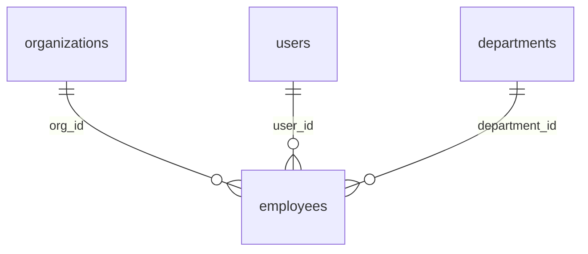

# Quick Start - Database Analysis

## Run the Script

```bash
npm run analyze-db
```

## What It Does

1. Connects to your OMS MySQL database
2. Analyzes all tables, columns, and relationships
3. Generates `database_analysis.md` with:
   - Complete table documentation
   - Column descriptions
   - Foreign key relationships
   - ER diagram (Mermaid)
   - Summary statistics

## Example Output

The generated report includes sections like:

### employees Table
- **Purpose**: Links users to organizations with employment details
- **Columns**: id, user_id, org_id, designation, role, salary, etc.
- **Relationships**: 
  - `user_id` → `users.id`
  - `org_id` → `organizations.id`
  - `department_id` → `departments.id`

### Visual ER Diagram


## Requirements

- Database must be running
- `.env` file configured with DB credentials
